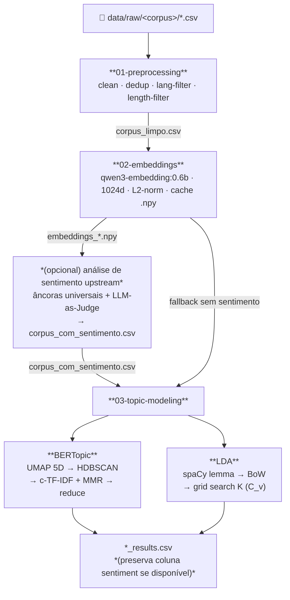

# Framework Híbrido de Análise Textual — LLM + NLP

Framework didático e reproduzível para análise qualitativa de corpus textuais em **português brasileiro e inglês**, construído como artefato da dissertação de mestrado do **PPGEC/UPE**. Combina embeddings semânticos densos, modelagem probabilística clássica e LLMs locais para responder duas perguntas complementares sobre qualquer corpus textual:

- **Sobre o que falam?** → Modelagem de tópicos (BERTopic, LDA)
- **Com que tom falam?** → Análise de sentimento zero-shot via âncoras universais + LLM-as-Judge

O artefato primário são **notebooks Jupyter didáticos**. O framework é totalmente *corpus-agnostic*: para analisar um novo corpus basta declarar uma entrada em `params.yaml` e fornecer um CSV em `data/raw/` — toda a pipeline downstream funciona sem alterações de código.

---

## Quick Start

### 1. Ambiente Python

```powershell
python -m venv venv
venv\Scripts\activate
pip install -r requirements.txt
python -m spacy download pt_core_news_lg   # PT-BR
python -m spacy download en_core_web_sm    # EN
```

### 2. Ollama (embeddings + nomeação de tópicos)

```powershell
ollama pull qwen3-embedding:0.6b   # vetorização de documentos
ollama pull gemma4:e4b             # nomeação de tópicos via LLM
ollama serve                       # deixar em background
```

### 3. Executar o pipeline completo

O pipeline é **linear**: preprocessing → embeddings → topic modeling. A transferência entre módulos é manual e explícita (cópia de arquivos). Repita os passos abaixo para cada corpus.

#### Corpora disponíveis

| Corpus ID | Arquivo bruto | Idioma |
|---|---|---|
| `folha` | `01-preprocessing/data/raw/folha/articles.csv` | PT-BR |
| `ag_news` | `01-preprocessing/data/raw/ag_news/ag_news.csv` | EN |
| `reuters` | `01-preprocessing/data/raw/reuters/reuters.csv` | EN |
| `tweets_bre2022` | `01-preprocessing/data/raw/tweets_bre2022/tweets_bre2022.csv` | PT-BR |

---

#### Passo 1 — Pré-processamento

Abra `01-preprocessing/notebooks/01_preprocessing.ipynb`, ajuste `CORPUS = "<corpus>"` e rode do início ao fim.

```powershell
cd 01-preprocessing\notebooks
jupyter lab
```

Saída gerada: `01-preprocessing/data/output/<corpus>/corpus_limpo.csv`

---

#### Passo 2 — Copiar para embeddings

```powershell
$CORPUS = "folha"   # <-- alterar para cada corpus

New-Item -ItemType Directory -Force "02-embeddings\data\input\$CORPUS"
Copy-Item "01-preprocessing\data\output\$CORPUS\corpus_limpo.csv" `
          "02-embeddings\data\input\$CORPUS\corpus_limpo.csv"
```

---

#### Passo 3 — Embeddings

Abra `02-embeddings/notebooks/02_embeddings.ipynb`, ajuste `CORPUS = "<corpus>"` e rode. Requer `ollama serve` com `qwen3-embedding:0.6b` em background.

```powershell
cd 02-embeddings\notebooks
jupyter lab
```

Saída gerada: `02-embeddings/data/output/<corpus>/embeddings_qwen3-embedding_0.6b_1024d.npy`

> **Performance:** ~50–200 docs/s dependendo do hardware. Para 100k docs espere 10–30 min na primeira vez; nas seguintes o cache `.npy` é reutilizado automaticamente.

---

#### Passo 4 — Copiar para topic modeling

```powershell
$CORPUS = "folha"   # <-- alterar para cada corpus

New-Item -ItemType Directory -Force "03-topic-modeling\data\input\$CORPUS"
Copy-Item "01-preprocessing\data\output\$CORPUS\corpus_limpo.csv" `
          "03-topic-modeling\data\input\$CORPUS\corpus_limpo.csv"
Copy-Item "02-embeddings\data\output\$CORPUS\embeddings_qwen3-embedding_0.6b_1024d.npy" `
          "03-topic-modeling\data\input\$CORPUS\embeddings_qwen3-embedding_0.6b_1024d.npy"
```

> **Opcional:** se você rodou análise de sentimento upstream, copie também `corpus_com_sentimento.csv` para o mesmo destino. O módulo 03 detecta automaticamente e herda a coluna `sentiment` nos outputs.

---

#### Passo 5 — Topic modeling

```powershell
cd 03-topic-modeling\notebooks
jupyter lab
```

Escolha o notebook do corpus e modelo desejado:

| Modelo | Folha | AG News | Reuters | Tweets BR 2022 |
|---|---|---|---|---|
| **BERTopic** | `bertopic/01_bertopic_folha.ipynb` | `bertopic/01_bertopic_ag_news.ipynb` | `bertopic/01_bertopic_reuters.ipynb` | `bertopic/01_bertopic_tweets_bre2022.ipynb` |
| **LDA** | `lda/02_lda_folha.ipynb` | `lda/02_lda_ag_news.ipynb` | `lda/02_lda_reuters.ipynb` | `lda/02_lda_tweets_bre2022.ipynb` |

A única célula a editar é `CORPUS_ID = "..."`. Rode do início ao fim.

Saídas em `03-topic-modeling/data/output/<corpus>/`:
- `bertopic_results.csv` / `lda_results.csv` — um documento por linha com `topic_id`, `topic_name`, distribuição `θ`
- `*.png` — visualizações diagnósticas (wordclouds, heatmaps, UMAP, Jaccard, pyLDAvis)
- `*.html` — visualizações interativas (pyLDAvis, barchart Plotly, mapa de documentos)

---

#### Script de cópia para todos os corpora de uma vez

```powershell
foreach ($corpus in @("folha","ag_news","reuters","tweets_bre2022")) {
    New-Item -ItemType Directory -Force "02-embeddings\data\input\$corpus"
    Copy-Item "01-preprocessing\data\output\$corpus\corpus_limpo.csv" `
              "02-embeddings\data\input\$corpus\corpus_limpo.csv" -ErrorAction SilentlyContinue

    New-Item -ItemType Directory -Force "03-topic-modeling\data\input\$corpus"
    Copy-Item "01-preprocessing\data\output\$corpus\corpus_limpo.csv" `
              "03-topic-modeling\data\input\$corpus\corpus_limpo.csv" -ErrorAction SilentlyContinue
    Copy-Item "02-embeddings\data\output\$corpus\*.npy" `
              "03-topic-modeling\data\input\$corpus\" -ErrorAction SilentlyContinue
}
```

---

## Contexto de pesquisa

> Documento completo: `topic_modeling.docx`

Investigação comparativa conduzida no PPGEC/UPE com foco em validar empiricamente quais modelos de topic modeling servem melhor a cada classe de corpus.

**Pergunta central:** "Sobre o que falam?" — validar quais modelos, em quais condições, respondem essa pergunta de forma confiável.

**4 corpora canônicos** com variação sistemática de idioma, registro, tamanho e volume:

| Corpus | Idioma | Registro | Docs | Tokens/doc |
|---|---|---|---|---|
| folha (Folha de São Paulo) | PT-BR | Formal/jornalístico | ~variável | ~variável |
| tweets_bre2022 (Eleições BR) | PT-BR | Informal | ~200k | ~23 |
| reuters-21578 | EN | Formal | ~7.7k | ~120 |
| ag_news | EN | Formal/news | ~127k | ~50 |

**Hipóteses principais:**
- **H1** BERTopic generaliza entre idiomas/domínios com `language="multilingual"` e ordem correta de pós-processamento (`reduce_outliers → update_topics → reduce_topics → update_topics`)
- **H2** LDA degrada em texto curto/informal (tweets, posts) vs corpus formal — c_v cai, top-words ficam dominados por tokens raros
- **H3** BERTopic mantém qualidade em texto formal mas perde a vantagem do θ probabilístico do LDA para análises downstream
- **H4** Seleção de K no LDA exige combinação de c_v + cobertura de categorias canônicas + inspeção qualitativa

---

## 0. Resumo dos pipelines

O framework é composto por três módulos principais (`01-preprocessing`, `02-embeddings`, `03-topic-modeling`) mais uma etapa upstream opcional de sentimento, que se compõem em uma cadeia linear de processamento. Cada módulo consome a saída do anterior e produz um artefato versionado em disco, de modo que qualquer etapa pode ser re-executada isoladamente sem refazer as anteriores. As subseções a seguir descrevem o algoritmo interno de cada módulo, acompanhado do seu fluxograma operacional.

### 0.1 Pré-Processamento (`01-preprocessing/`)

O processo segue sete estágios: (i) primeiro passa por uma fase de **Ingestão**, na qual um ou mais CSVs brutos são lidos em UTF-8 com o separador declarado em `params.yaml`, e o *schema* é normalizado via `rename`, `drop` e `add_constants`; (ii) em seguida, na **Deduplicação**, documentos vazios e duplicatas exatas são descartados; (iii) na fase de **Limpeza Textual**, *emojis* Unicode são convertidos em *tokens* semânticos legíveis, sequências de caracteres repetidos são colapsadas via *regex* `(.)\1{2,}`, e *whitespace* é normalizado — preservando intencionalmente URLs, *hashtags* e menções como sinal temático; (iv) o **Filtro de Idioma** aplica `langdetect` (apenas em documentos com pelo menos cinco palavras) para reter apenas o idioma-alvo declarado; (v) o **Filtro de Comprimento** remove documentos abaixo de `min_chars` ou `min_words`, evitando fragmentos instáveis em modelagem downstream; (vi) a **Atribuição de Identificador** garante a unicidade do `post_id` — chave de cruzamento *end-to-end* entre os módulos —, preservando-o quando já existente ou gerando-o sequencialmente; e (vii) finalmente, na **Exportação**, o *DataFrame* resultante é gravado como `corpus_limpo.csv` em UTF-8, junto com três gráficos diagnósticos (distribuição de idioma, caracteres e palavras).

```
    +--------------------+
    | data/raw/<corpus>/ |
    |       *.csv        |
    +---------+----------+
              |
              v
    +-------------------------------------+
    | (i) Carga                           |
    |     read_csv + rename + drop +      |
    |     add_constants                   |
    +-------------------------------------+
              |
              v
    +-------------------------------------+
    | (ii) Dedup                          |
    |     dropna + drop_duplicates        |
    +-------------------------------------+
              |
              v
    +-------------------------------------+
    | (iii) Limpeza de texto              |
    |     demojize Unicode -> token       |
    |     regex (.)\1{2,} -> $1$1         |
    |     normaliza whitespace            |
    +-------------------------------------+
              |
              v
    +-------------------------------------+    +-------------+
    | (iv) Filtro de idioma               |--->| descartados |
    |     langdetect (>= 5 palavras)      |    +-------------+
    +-------------------------------------+
              |
              v
    +-------------------------------------+    +-------------+
    | (v) Filtro de comprimento           |--->| descartados |
    |     min_chars AND min_words         |    +-------------+
    +-------------------------------------+
              |
              v
    +-------------------------------------+
    | (vi) post_id unico                  |
    |     preserva id_column ou gera      |
    +-------------------------------------+
              |
              v
    +-------------------------------------+
    | (vii) Export UTF-8                  |
    +---------+---------------------------+
              |
              v
    +-------------------------------------+
    | data/output/<corpus>/               |
    |    corpus_limpo.csv                 |
    +-------------------------------------+
```

### 0.2 Embeddings (`02-embeddings/`)

O processo segue quatro estágios: (i) inicia-se com a **Verificação de Cache**, na qual o módulo procura por um arquivo `.npy` pré-existente com a nomenclatura e o *shape* esperados, evitando recomputação dispendiosa; (ii) caso o cache não exista, a fase de **Computação Assíncrona** dispara requisições paralelas (com `asyncio.Semaphore(5)`) ao endpoint `/api/embeddings` do Ollama local, usando o modelo multilíngue `qwen3-embedding:0.6b` que produz vetores de 1024 dimensões nativos; (iii) na fase de **Normalização**, cada vetor é dividido por sua norma L2 individualmente, garantindo que a similaridade *cosine* se reduza a um produto escalar nas etapas subsequentes; e (iv) finalmente, na **Persistência e Validação**, os vetores são empilhados em um *array* NumPy `(n_docs, 1024)` em `float32`, gravados em disco e submetidos a *sanity checks* (ausência de `NaN`/`Inf`, normas próximas a 1.0, variância dimensional adequada) antes de serem considerados aptos ao consumo *downstream*.

```
    +----------------------+
    | corpus_limpo.csv     |
    +----------+-----------+
               |
               v
    +------------------------------------+
    | (i) Cache embeddings_*.npy existe  |
    | e shape (n_docs, 1024) confere?    |
    +-----+---------------------------+--+
          |                           |
         sim                         nao
          |                           |
          v                           v
    +-----------+    +------------------------------+
    | np.load() |    | (ii) Async batch (sem = 5)   |
    +-----+-----+    | POST /api/embeddings         |
          |          | (Ollama qwen3-embedding 0.6b)|
          |          +---------------+--------------+
          |                          |
          |                          v
          |          +------------------------------+
          |          | (iii) L2 normalize por doc   |
          |          | np.stack -> dtype float32    |
          |          +---------------+--------------+
          |                          |
          |                          v
          |          +------------------------------+
          |          | np.save(.npy)                |
          |          +---------------+--------------+
          |                          |
          +------------+-------------+
                       v
    +-------------------------------------+
    | (iv) Sanity checks                  |
    | - sem NaN / Inf                     |
    | - shape (n_docs, 1024)              |
    | - normas ~ 1.0                      |
    +-------------------------------------+
                       |
                       v
    +-------------------------------------+
    | embeddings_qwen3-embedding_0.6b_    |
    |   1024d.npy                         |
    +-------------------------------------+
```

### 0.3 Análise de Sentimento (etapa upstream — `corpus_com_sentimento.csv`)

> **Nota de estrutura:** No pipeline refatorado, a análise de sentimento é uma etapa upstream opcional. Se `corpus_com_sentimento.csv` estiver disponível em `03-topic-modeling/data/input/<corpus>/`, os outputs de tópicos herdam automaticamente a coluna `sentiment`. Caso contrário, o módulo usa `corpus_limpo.csv` (sem coluna `sentiment` nos outputs).

O processo segue cinco estágios: (i) na fase de **Carregamento**, o módulo lê simultaneamente o `corpus_limpo.csv` e os embeddings cacheados pelo módulo anterior; (ii) em paralelo, na **Embedding das Âncoras**, vinte sentenças-âncora universais e bilíngues (dez positivas, dez negativas, declaradas globalmente em `sentiment.anchors` no `params.yaml`) são vetorizadas pelo mesmo modelo de embeddings, garantindo o alinhamento do espaço semântico; (iii) na **Construção de Centroides**, calcula-se a média aritmética dos embeddings de cada classe, normalizada L2, produzindo dois vetores de referência no espaço 1024-dimensional; (iv) na fase de **Classificação Geométrica**, a similaridade *cosine* entre cada documento e os dois centroides é computada via produto escalar matricial — a classe é definida pelo `argmax` e a `confidence` pela margem entre top-1 e top-2; e (v) finalmente, na **Validação Independente**, um modelo independente (`gemma4:e4b`) é submetido a uma amostra estratificada de trinta documentos sob um *prompt* universal bilíngue, e o *agreement* com o classificador define se as âncoras estão validadas (≥ 90%), marginais (75-89%) ou se precisam ser redesenhadas (< 75%).

```
    +----------------------+   +-------------------------+
    | (i) corpus_limpo.csv |   | params.yaml             |
    +----------+-----------+   |   sentiment.anchors:    |
               |               |     positive: [10 sent] |
    +----------+-----------+   |     negative: [10 sent] |
    | embeddings_*.npy     |   +-----------+-------------+
    +----------+-----------+               |
               |                           v
               |              +-------------------------+
               |              | (ii) Embeda 20 ancoras  |
               |              | via Ollama              |
               |              +-----------+-------------+
               |                          |
               |                          v
               |              +-------------------------+
               |              | (iii) Centroide/classe  |
               |              | = mean(emb) + L2 norm   |
               |              +-----------+-------------+
               |                          |
               +-------------+------------+
                             v
               +--------------------------------+
               | (iv) Cosine docs x centroides  |
               | sentiment = argmax(sims)       |
               | confidence = top_1 - top_2     |
               +--------------+-----------------+
                              |
                +-------------+-------------+
                |                           |
                v                           v
    +-----------------------+    +-------------------------+
    | sentiment_results.csv |    | (v) Validacao LLM-Judge |
    | (auditoria, minimo)   |    | - amostra N=30          |
    |                       |    | - gemma4:e4b            |
    | corpus_com_sentimento |    | - prompt universal      |
    | .csv (input do 04)    |    |   bilingue              |
    +-----------------------+    +------------+------------+
                                              |
                                              v
                                     +-----------------+
                                     | agreement >= 90 |
                                     +--+-----------+--+
                                       sim         nao
                                        |           |
                                        v           v
                                +-----------+ +-------------+
                                | aprovado  | | revisar     |
                                |           | | ancoras     |
                                +-----------+ +-------------+
```

### 0.4 Modelagem de Tópicos — BERTopic (`03-topic-modeling/`)

O processo segue cinco estágios: (i) inicia-se com o **Carregamento** do corpus via `load_corpus()`, que prefere automaticamente `corpus_com_sentimento.csv` quando disponível (preservando a coluna de sentimento nos outputs finais), juntamente com os embeddings cacheados; (ii) na fase de **Redução Dimensional**, o UMAP projeta os vetores de 1024 dimensões em um espaço de cinco dimensões com métrica *cosine*, preservando a topologia local dos pontos; (iii) na **Clusterização por Densidade**, o HDBSCAN identifica agrupamentos sem exigir um número pré-fixado de tópicos, atribuindo a rótulo `-1` os documentos em regiões esparsas (*outliers*); (iv) na fase de **Representação**, o c-TF-IDF (TF-IDF baseado em classe) calcula a relevância distintiva de cada *token* para cada cluster, e o MMR (*Maximal Marginal Relevance*) diversifica os top *keywords* para evitar redundância; (v) finalmente, na **Pós-processamento**, o número de tópicos é reduzido conforme `reduce_topics_nr=30` e os *outliers* são realocados via estratégia c-TF-IDF, produzindo o `bertopic_results.csv` que herda automaticamente a coluna `sentiment` quando o corpus de entrada já a contém.

```
    +------------------------+
    | (i) corpus_com_        |
    |  sentimento.csv        |
    +-----------+------------+
                |
                v
    +------------------------+
    | embeddings_*.npy       |
    | (do modulo 02)         |
    +-----------+------------+
                |
                v
    +------------------------------+
    | (ii) UMAP -> 5D              |
    | cosine, n_neighbors=15,      |
    | min_dist=0.0                 |
    +-------------+----------------+
                  |
                  v
    +------------------------------+
    | (iii) HDBSCAN                |
    | min_cluster_size=15          |
    | outliers -> rotulo -1        |
    +-------------+----------------+
                  |
                  v
    +------------------------------+
    | (iv) c-TF-IDF por cluster    |
    | + MMR (diversity=0.2)        |
    +-------------+----------------+
                  |
                  v
    +------------------------------+
    | (v) reduce_topics_nr=30      |
    | + reduce outliers (c-tf-idf) |
    +-------------+----------------+
                  |
                  v
    +------------------------------+
    | bertopic_results.csv         |
    | (preserva coluna sentiment   |
    |  se corpus enriquecido)      |
    +------------------------------+
```

### 0.5 Modelagem de Tópicos — LDA (`03-topic-modeling/`)

O processo segue cinco estágios: (i) inicia-se com o **Pré-processamento Linguístico**, no qual o spaCy aplica lematização sensível ao idioma (`pt_core_news_lg` para PT-BR ou `en_core_web_sm` para EN), filtra por classes gramaticais informativas (substantivos, verbos, adjetivos) e remove *stopwords* da língua-alvo; (ii) na fase de **Construção do Vocabulário**, o `gensim.corpora.Dictionary` mapeia *tokens* para identificadores numéricos, descartando termos raros (`no_below=5`) e termos excessivamente comuns (`no_above=0.5`), e converte cada documento em uma representação *Bag-of-Words*; (iii) na **Busca em Grade**, para cada `K ∈ [k_min, k_max]` o `LdaMulticore` é treinado com dez *passes* de Variational EM e a métrica de coerência **C_v** é calculada — o `K*` ótimo é aquele que maximiza `C_v`; (iv) na fase de **Treinamento Final**, o modelo é re-treinado com `K*` fixado e vinte *passes*, e os top dez *keywords* por tópico são extraídos por probabilidade `p(palavra | tópico)`; (v) finalmente, na **Atribuição Documento-Tópico**, cada documento recebe o tópico dominante via `argmax(theta)` da distribuição de mistura, produzindo o `lda_results.csv` com o mesmo *schema* do BERTopic — o que permite triangulação cross-model via NPMI e Jaccard.

```
    +------------------------+
    | corpus_com_sentimento  |
    | .csv (ou corpus_limpo) |
    +-----------+------------+
                |
                v
    +------------------------------+
    | (i) spaCy lemmatize          |
    | (pt_core_news_lg ou          |
    |  en_core_web_sm)             |
    | + filtro POS + stopwords     |
    +-------------+----------------+
                  |
                  v
    +------------------------------+
    | (ii) gensim Dictionary       |
    | no_below=5  (raros)          |
    | no_above=0.5 (muito comuns)  |
    | BoW: doc -> [(token, freq)]  |
    +-------------+----------------+
                  |
                  v
    +------------------------------+
    | (iii) Grid search K [5, 30]  |
    | para cada K:                 |
    |   LdaMulticore (10 passes)   |
    |   calcula C_v coherence      |
    | K* = argmax(C_v)             |
    +-------------+----------------+
                  |
                  v
    +------------------------------+
    | (iv) Modelo final            |
    | K*, 20 passes                |
    | top-10 keywords por topico   |
    | via p(palavra | topico)      |
    +-------------+----------------+
                  |
                  v
    +------------------------------+
    | (v) argmax(theta_doc)        |
    | doc -> topico dominante      |
    +-------------+----------------+
                  |
                  v
    +------------------------------+
    | lda_results.csv              |
    | (preserva coluna sentiment   |
    |  se corpus enriquecido)      |
    +------------------------------+
```

---

## 1. Arquitetura geral

### DAG de execução



A DAG é **linear**: cada módulo consome a saída do anterior. A etapa upstream de sentimento enriquece o corpus com uma coluna `sentiment`, e o `03-topic-modeling` recebe esse corpus enriquecido — assim os resultados de cada modelo de tópico já vêm com a polaridade de cada documento anexada, sem precisar de merge manual posterior.

### Transferência de dados entre módulos

A transferência é **manual e explícita**: cada módulo escreve em `data/output/`, e o consumidor lê de `data/input/`. Você copia (ou faz symlink) os artefatos relevantes entre eles. Isso preserva isolamento e permite cache trivial.

| Produtor | Arquivo de saída | Consumidor |
|---|---|---|
| `01-preprocessing` | `data/output/<corpus>/corpus_limpo.csv` | `02-embeddings` |
| `02-embeddings` | `data/output/<corpus>/embeddings_qwen3-embedding_0.6b_1024d.npy` | `(upstream sentiment)` |
| `(upstream sentiment)` | `data/output/<corpus>/corpus_com_sentimento.csv` | `03-topic-modeling` |
| `03-topic-modeling` | `data/output/<corpus>/{bertopic,lda}_results.csv` (já incluem coluna `sentiment`) + `*_topics_for_eval.csv` | análises externas |

O `corpus_com_sentimento.csv` é o `corpus_limpo.csv` original acrescido das colunas `sentiment`, `confidence`, `sim_positive`, `sim_negative`. O módulo `03-topic-modeling` preserva todas essas colunas nos seus outputs — portanto cada `*_results.csv` contém simultaneamente `post_id`, `topic_id`, `topic_name`, `sentiment` e demais metadados.

#### Auto-detecção no módulo `03-topic-modeling`

O `03-topic-modeling` usa a função `load_corpus()` (em `notebooks/_helpers.py`) que faz **auto-detecção** do arquivo de input:

1. Procura primeiro por `corpus_com_sentimento.csv` em `data/input/<corpus>/`
2. Se não existir, cai para `corpus_limpo.csv`
3. Se nenhum dos dois existir, levanta `FileNotFoundError` explícito

Assim, você pode copiar o `corpus_com_sentimento.csv` para `03-topic-modeling/data/input/<corpus>/` **sem precisar renomear** — o framework identifica automaticamente e os outputs de tópico herdam a coluna `sentiment`. Se quiser rodar o `03-topic-modeling` sem ter passado pela etapa de sentimento (caminho mais curto), basta copiar `corpus_limpo.csv` que continua funcionando — só os outputs não terão a coluna `sentiment`.

A coluna `post_id` permanece como chave de cruzamento *end-to-end*, útil para joins ad-hoc entre quaisquer outputs.

---

## 2. Instalação

### Dependências

- **Python ≥ 3.10**
- **Ollama** rodando localmente em `http://localhost:11434` com os modelos:
  - `qwen3-embedding:0.6b` (embeddings, 1024d nativo)
  - `gemma4:e4b` (nomeação de tópicos via LLM)

### Setup do ambiente

```bash
python -m venv venv
source venv/bin/activate          # Linux/macOS
venv\Scripts\activate             # Windows PowerShell
pip install -r requirements.txt
```

`requirements.txt` na raiz cobre todas as dependências Python do pipeline.

### Setup do Ollama

```bash
ollama pull qwen3-embedding:0.6b
ollama pull gemma4:e4b
ollama serve   # mantenha em background
```

---

## 3. Estrutura do repositório

```
.
├── CLAUDE.md                         # guia para Claude Code (setup, convenções, comandos)
├── README.md                         # este arquivo
├── requirements.txt
├── topic_modeling.docx               # documento de pesquisa (RQs, hipóteses, decisões)
├── 01-preprocessing/
│   ├── configs/params.yaml
│   ├── notebooks/01_preprocessing.ipynb
│   └── data/{raw,input,output}/
├── 02-embeddings/
│   ├── configs/params.yaml
│   ├── notebooks/02_embeddings.ipynb
│   └── data/{input,output}/
└── 03-topic-modeling/
    ├── configs/params.yaml
    ├── notebooks/
    │   ├── _helpers.py                  # funções utilitárias consolidadas (2000+ linhas)
    │   ├── bertopic/
    │   │   ├── 00_template_bertopic.ipynb
    │   │   ├── 01_bertopic.ipynb           # social (PT-BR) — padrão de visualização
    │   │   ├── 01_bertopic_agnews.ipynb    # AG News (EN)
    │   │   ├── 01_bertopic_reuters.ipynb   # Reuters-21578 (EN)
    │   │   └── 05_bertopic_tweets.ipynb    # Tweets BR 2022 (PT-BR)
    │   └── lda/
    │       ├── 02_lda.ipynb               # social (PT-BR)
    │       ├── 02_lda_agnews.ipynb         # AG News (EN)
    │       ├── 02_lda_reuters.ipynb        # Reuters-21578 (EN)
    │       └── 02_lda_tweets.ipynb         # Tweets BR 2022 (PT-BR)
    └── data/{input,output}/
```

Cada módulo segue o padrão **notebooks-puros**: artefato primário é o `.ipynb`, sem `src/` Python e sem testes formais. Helpers reutilizáveis ficam em `notebooks/_helpers.py` (em `03-topic-modeling`, por complexidade).

---

## 4. Módulo `01-preprocessing` — Limpeza e padronização

### Propósito

Transformar arquivos heterogêneos em `data/raw/` em um `corpus_limpo.csv` padronizado, preservando sinal informativo (URLs, hashtags, menções, emojis semantizados) e descartando ruído (duplicatas, idioma errado, docs curtos demais).

### Fluxograma

```
    +--------------------+
    | data/raw/<corpus>/ |
    |       *.csv        |
    +---------+----------+
              |
              v
    +-------------------------------------+
    | (1) Carga                           |
    |     read_csv + rename + drop +      |
    |     add_constants                   |
    +-------------------------------------+
              |
              v
    +-------------------------------------+
    | (2) Dedup                           |
    |     dropna + drop_duplicates        |
    +-------------------------------------+
              |
              v
    +-------------------------------------+
    | (3) Limpeza de texto                |
    |     demojize Unicode -> token       |
    |     regex (.)\1{2,} -> $1$1         |
    |     normaliza whitespace            |
    +-------------------------------------+
              |
              v
    +-------------------------------------+    +-------------+
    | (4) Filtro de idioma                |--->| descartados |
    |     langdetect (>= 5 palavras)      |    +-------------+
    +-------------------------------------+
              |
              v
    +-------------------------------------+    +-------------+
    | (5) Filtro de comprimento           |--->| descartados |
    |     min_chars AND min_words         |    +-------------+
    +-------------------------------------+
              |
              v
    +-------------------------------------+
    | (6) post_id unico                   |
    |     preserva id_column ou gera      |
    |     post_0000 .. post_NNNN          |
    +-------------------------------------+
              |
              v
    +-------------------------------------+
    | (7) Reordena colunas + export UTF-8 |
    +-------------------------------------+
              |
              v
    +-------------------------------------+
    | data/output/<corpus>/               |
    |    corpus_limpo.csv                 |
    +-------------------------------------+
```

### Algoritmo (7 passos)

| # | Etapa | Operação | Por que importa |
|---|---|---|---|
| 1 | **Carga** | `pd.read_csv` com `sep`/`encoding` do params.yaml; aplica `rename`, `drop`, `add_constants` | Normaliza schemas heterogêneos para um schema único |
| 2 | **Dedup** | Remove `NaN` e strings vazias; `drop_duplicates` exato | Elimina erros de coleta e reposts |
| 3 | **Limpeza** | Demojize Unicode → token semântico; regex `(.)\1{2,}` → `$1$1`; `\s+` → ` ` | Reduz vocabulário inflado sem perder ênfase. **Preserva URLs, @mentions, #hashtags** intactos. |
| 4 | **Idioma** | `langdetect.detect()` (apenas docs ≥ 5 palavras); filtra docs ≠ `LANG_TARGET` | Remove spam multilíngue e bots |
| 5 | **Comprimento** | Descarta docs com `len(text) < min_chars` OU `n_palavras < min_words` | Evita fragmentos instáveis em LDA/BERTopic |
| 6 | **ID primária** | Preserva coluna `id_column` se existir (converte para `str`); senão gera `post_0000`, `post_0001`, ... | Chave de cruzamento entre sentimento e tópicos |
| 7 | **Export** | Reordena colunas para `[post_id, text_column, message_raw, ...]`; salva UTF-8 | Schema previsível para downstream |

### Métodos e bibliotecas

`pandas`, `langdetect`, `emoji` (demojize com locale PT/EN), `re` (regex), `pathlib`, `matplotlib` (histogramas diagnósticos), `yaml`.

**Nenhuma lematização ou remoção de stopwords aqui** — essas operações são domain-specific demais para o preprocessing geral e ficam em cada módulo downstream que precisar (LDA faz lematização própria via spaCy).

### Parâmetros principais (`configs/params.yaml`)

Por corpus:

| Chave | Função |
|---|---|
| `text_column` | Nome da coluna de texto após `rename` |
| `id_column` | Nome da coluna de ID (ou `null` para gerar `post_NNNN`) |
| `language` | ISO 639-1 (`pt`, `en`, ...) — usado por `langdetect` |
| `csv.sep` / `csv.encoding` | Separador e encoding do CSV bruto |
| `rename` | Mapa `coluna_bruta → coluna_padrão` |
| `drop` | Colunas a descartar |
| `add_constants` | Pares chave-valor para inserir como colunas constantes (ex.: `platform: rede_social`) |
| `min_doc_length` | Mínimo de caracteres pós-limpeza |
| `min_words` | Mínimo de palavras pós-limpeza |
| `emoji_handling` | `demojize_pt` ou `demojize_en` |

Globais: `seed: 42`, `default_corpus`.

### Inputs

CSV(s) em `data/raw/<corpus>/`. Múltiplos arquivos no mesmo subdir são concatenados. Encoding e separador são definidos no `params.yaml`.

### Outputs

`data/output/<corpus>/corpus_limpo.csv` (UTF-8) com colunas mínimas:

| Coluna | Tipo | Conteúdo |
|---|---|---|
| `post_id` | str | Chave única (preservada ou gerada) |
| `<text_column>` | str | Texto limpo |
| `message_raw` | str | Texto bruto (para diagnóstico) |
| ... | ... | Quaisquer covariates declaradas no `params.yaml` (ex.: `platform`, `category`, `date`, ...) |

Além disso, três gráficos PNG: distribuição de idiomas, de caracteres e de palavras.

---

## 5. Módulo `02-embeddings` — Vetorização densa

### Propósito

Produzir embeddings de documento (1 vetor por linha do `corpus_limpo.csv`) com um modelo multilíngue, cacheados em `.npy` para reutilização sem custo pela etapa de sentimento upstream e pelo `03-topic-modeling`.

### Fluxograma

```
    +----------------------+
    | corpus_limpo.csv     |
    +----------+-----------+
               |
               v
    +------------------------------------+
    | Cache embeddings_*.npy existe e    |
    | shape (n_docs, 1024) confere?      |
    +-----+-------------------------+----+
          |                         |
         sim                       nao
          |                         |
          v                         v
    +-----------+    +------------------------------+
    | np.load() |    | Async batch (semaforo = 5)   |
    +-----+-----+    | POST /api/embeddings         |
          |         | (Ollama qwen3-embedding 0.6b)|
          |         +---------------+--------------+
          |                         |
          |                         v
          |         +------------------------------+
          |         | L2 normalize por documento   |
          |         | np.stack -> dtype float32    |
          |         +---------------+--------------+
          |                         |
          |                         v
          |         +------------------------------+
          |         | np.save(.npy)                |
          |         +---------------+--------------+
          |                         |
          +------------+------------+
                       v
    +-------------------------------------+
    | Sanity checks                       |
    | - sem NaN / Inf                     |
    | - shape (n_docs, 1024)              |
    | - normas ~ 1.0 (variancia baixa)    |
    | - UMAP 2D para inspecao visual      |
    +------------+------------------------+
                 |
                 v
    +-------------------------------------+
    | data/output/<corpus>/               |
    |   embeddings_qwen3-embedding_0.6b_  |
    |   1024d.npy                         |
    +-------------------------------------+
```

### Algoritmo

1. **Leitura** do `corpus_limpo.csv`; identifica `text_column` via `params.yaml`.
2. **Verificação de cache**: procura `embeddings_<safe_model>_<suffix>.npy` em `data/output/<corpus>/`. Se existe e shape bate (`n_docs × dim_esperada`), carrega.
3. **Embedding em batch assíncrono**: `asyncio.Semaphore(5)` limita concorrência; para cada texto, POST a `http://localhost:11434/api/embeddings`.
4. **(Opcional) Matryoshka truncation**: se `dimension: <int>` for declarado em `params.yaml`, faz slice `emb[:dimension]`. Por padrão `null` → mantém 1024d nativo.
5. **L2 normalize**: `emb / np.linalg.norm(emb)`. Embeddings normalizados → cosine = dot product (mais rápido downstream).
6. **Stack + cast**: `np.stack(vecs).astype(np.float32)`. Float32 economiza 50% de memória vs float64.
7. **Persistência**: `np.save(path, arr)`.
8. **Sanity checks**: contagem de NaN/Inf, média e desvio padrão das normas, variância por dimensão, UMAP 2D para inspeção visual.

### Métodos e bibliotecas

`httpx` (async HTTP client), `asyncio` (concorrência), `numpy` (stack, norm, save), `umap-learn` (visualização), `pandas` (leitura CSV).

### Parâmetros principais

```yaml
embeddings:
  models:
    - name: qwen3-embedding:0.6b
      backend: ollama
      dimension: null          # null = 1024d nativo
      suffix: 1024d
      timeout: 120              # segundos por requisição
  ollama_timeout_default: 120
```

### Inputs / Outputs

- **Input**: `data/input/<corpus>/corpus_limpo.csv`
- **Output**: `data/output/<corpus>/embeddings_qwen3-embedding_0.6b_1024d.npy`
  - Shape `(n_docs, 1024)`, dtype `float32`, normalizado L2
  - Ordem das linhas corresponde 1:1 com `corpus_limpo.csv`

### Performance

Embeddings em batch async tipicamente processam **~50–200 docs/seg** dependendo do hardware do Ollama (CPU vs GPU). Para 100k docs: ~10–30 min. O cache em `.npy` torna re-execuções triviais (1–2s de I/O).

---

## 6. Módulo `03-sentiment` — Sentimento zero-shot via âncoras universais

### Propósito

Classificar cada documento como `positive` ou `negative` **sem treinamento, sem corpus rotulado**, comparando o embedding do doc contra centroides de sentenças-âncora universais (PT-BR + EN). Validar a qualidade via LLM-as-Judge independente.

### Fluxograma

```
    +----------------------+   +-------------------------+
    | corpus_limpo.csv     |   | params.yaml             |
    +----------+-----------+   |   sentiment.anchors:    |
               |               |     positive: [10 sent] |
    +----------+-----------+   |     negative: [10 sent] |
    | embeddings_*.npy     |   +-----------+-------------+
    | (do modulo 02)       |               |
    +----------+-----------+               v
               |                +-------------------------+
               |                | Embeda 20 ancoras       |
               |                | via Ollama              |
               |                +-----------+-------------+
               |                            |
               |                            v
               |                +-------------------------+
               |                | Centroide por classe    |
               |                | = mean(emb da classe)   |
               |                | + L2 normalize          |
               |                +-----------+-------------+
               |                            |
               +-------------+--------------+
                             v
               +--------------------------------+
               | Cosine: docs x centroides      |
               | sims = docs_norm @ centroids.T |
               +--------------+-----------------+
                              |
                              v
               +--------------------------------+
               | sentiment = argmax(sims)       |
               | confidence = top_1 - top_2     |
               +--------------+-----------------+
                              |
                +-------------+-------------+
                |                           |
                v                           v
    +-----------------------+    +-------------------------+
    | Outputs do modulo 03  |    | Validacao LLM-as-Judge  |
    | (gravados em disco)   |    | - amostra N=30          |
    |                       |    | - gemma4:e4b            |
    | sentiment_results.csv |    | - prompt universal      |
    |  (audit, minimo)      |    |   bilingue              |
    |                       |    +------------+------------+
    | corpus_com_sentimento |                 |
    |  .csv (para 04)       |                 v
    +-----------+-----------+         +---------------+
                |                     | agreement>=90 |
                v                     +-+-----------+-+
       +----------------+              sim         nao
       | 04-topic-      |               |           |
       | modeling       |               v           v
       | (proxima etapa)|         +----------+ +---------+
       +----------------+         | aprovado | | revisar |
                                  +----------+ | ancoras |
                                               | globais |
                                               +---------+
```

### Algoritmo

1. **Carregar âncoras** do bloco global `sentiment.anchors` no `params.yaml` (10 sentenças positivas + 10 negativas, bilíngues 5 PT + 5 EN — domain-agnostic).
2. **Embedar as 20 âncoras** via Ollama (mesmo modelo do módulo 02).
3. **Calcular centroide por classe**: `centroid_c = mean(embeddings das sentenças da classe c)`. Normalizar L2.
4. **Carregar embeddings dos docs** (cache `.npy` do módulo 02); normalizar L2.
5. **Cosine similarity**: `sims = docs_norm @ centroids.T` — matriz `(n_docs, 2)`.
6. **Classificação**: `sentiment = classes[argmax(sims, axis=1)]`.
7. **Confidence**: `top_1 − top_2` (margem entre similaridade máxima e segunda) — valores baixos sinalizam ambiguidade real.
8. **Persistir dois arquivos**:
   - `sentiment_results.csv` — versão mínima auditável `[post_id, text, sentiment, confidence, sim_positive, sim_negative]`
   - `corpus_com_sentimento.csv` — corpus completo do módulo 01 acrescido das colunas de sentimento. **Este é o input do módulo `03-topic-modeling`** — basta copiá-lo para `03-topic-modeling/data/input/<corpus>/` (sem renomear; o `load_corpus()` em `_helpers.py` detecta o arquivo automaticamente).

### LLM-as-Judge (validação)

Amostra estratificada de **N = 30** documentos (por covariate disponível, excluindo colunas de data). Um LLM (`gemma4:e4b`) recebe um **prompt bilíngue universal** sem informação do classificador, e responde `POSITIVO`/`NEGATIVO`. Critério de aceitação:

| Agreement | Decisão |
|---|---|
| **≥ 90%** | Âncoras universais validadas |
| **75–89%** | Marginal — revisar âncoras globais |
| **< 75%** | Redesenhar âncoras globais |

Importante: o ajuste é sempre no **bloco global** (afeta todos os corpora). Customizar por corpus violaria o princípio de universalidade.

### Curadoria das âncoras universais

| Critério | Aplicação |
|---|---|
| **Afeto puro** | Vocabulário emocional/avaliativo genérico; zero termos de domínio |
| **Bilíngue equilibrado** | 5 PT-BR + 5 EN por classe — `qwen3-embedding` alinha os dois idiomas no mesmo espaço |
| **Diversidade de registros** | 1ª pessoa, impessoal, existencial, nominal, impessoal passada (1 cada por classe) |
| **Paralelismo estrutural** | Cada sentença positiva tem espelho na negativa — normas dos centroides comparáveis |
| **Comprimento consistente** | 7–11 palavras |

Cobertura emocional (modelo de Russell, valência): alegria/tristeza, paz/sofrimento, admiração/repúdio, gratidão/raiva, contentamento/desespero.

### Parâmetros principais

```yaml
sentiment:
  approach: embedding_anchor
  embedder_model: qwen3-embedding:0.6b
  embedder_backend: ollama
  embedder_dimension: null
  classes: [negative, positive]
  granularity: document
  anchors:
    positive: [10 sentenças bilíngues]
    negative: [10 sentenças bilíngues]
  class_labels:
    positive: "Positivo"
    negative: "Negativo"
```

Blocos por-corpus contêm **apenas metadados de I/O** (`text_column`, `id_column`, `subdir`, `data_subdir`, `covariates`). Nenhuma lógica de classificação depende do corpus.

### Inputs / Outputs

- **Inputs**: `data/input/<corpus>/corpus_limpo.csv` + `data/input/<corpus>/embeddings_*.npy`
- **Outputs**:
  - `data/output/<corpus>/sentiment_results.csv` — versão mínima auditável: `[post_id, text, sentiment, confidence, sim_positive, sim_negative]`
  - `data/output/<corpus>/corpus_com_sentimento.csv` — corpus completo do módulo 01 + colunas de sentimento (este é o input do módulo `03-topic-modeling`)
  - PNGs: `sentiment_distribution.png`, `sentiment_confidence_distribution.png`, `sentiment_judge_confusion.png`

### Riscos conhecidos (documentados, não bugs)

| Risco | Comportamento |
|---|---|
| Texto descritivo/factual sem afeto explícito | `confidence` baixa — sinaliza ambiguidade real, não força classe |
| Sarcasmo / ironia | Limitação intrínseca de classificadores embedding-based |
| Texto bittersweet (afeto misto) | Centroide projeta para a face dominante, `confidence` cai |

---

## 7. Módulo `03-topic-modeling` — Modelagem de tópicos

### Propósito

Descobrir tópicos latentes em corpus textuais usando dois algoritmos complementares — **BERTopic** (denso, baseado em embeddings) e **LDA** (probabilístico clássico, BoW). Avaliar e comparar resultados via múltiplas métricas de coerência e diversidade.

### Fluxograma geral (2 algoritmos em paralelo)

```
                     +----------------------+
                     | corpus_limpo.csv     |
                     +----------+-----------+
                                |
                   +------------+------------+
                   |                         |
                   v                         v
           +---------------+         +---------------+
           | (A) BERTopic  |         |   (B) LDA     |
           +-------+-------+         +-------+-------+
                   |                         |
                   v                         v
       +------------------+      +-----------------+
       | embeddings .npy  |      | spaCy lemmatize |
       | (do modulo 02)   |      | (pt_core_news ou|
       +--------+---------+      |  en_core_web)   |
                |                +--------+--------+
                v                         |
       +------------------+               v
       | UMAP -> 5D       |      +-----------------+
       | (cosine, n=15)   |      | Dictionary BoW  |
       +--------+---------+      | no_below=5      |
                |                | no_above=0.5    |
                v                +--------+--------+
       +------------------+               |
       | HDBSCAN          |               v
       | min_cluster=15   |      +-----------------+
       +--------+---------+      | Grid search K   |
                |                | em [5, 30] via  |
                v                | C_v coherence   |
       +------------------+      +--------+--------+
       | c-TF-IDF         |               |
       | + MMR (div=0.2)  |               v
       +--------+---------+      +-----------------+
                |                | LdaMulticore    |
                v                | (K*, 20 passes) |
       +------------------+      +--------+--------+
       | reduce outliers  |               |
       | (c-tf-idf strat) |               v
       +--------+---------+      +-----------------+
                |                | argmax(theta)   |
                v                | doc -> topic    |
       +------------------+      +--------+--------+
       | bertopic_        |               |
       | results.csv      |               v
       +--------+---------+      +-----------------+
                |                | lda_results.csv |
                |                +--------+--------+
                |                         |
                +------------+------------+
                             |
                             v
         +-----------------------------------------+
         | Comparativo cross-model                 |
         | - C_v coherence                         |
         | - Semantic Coherence (MiniLM-L6)        |
         | - Topic Diversity (Dieng)               |
         | - Exclusivity c-TF-IDF, FREX            |
         | - NPMI / Jaccard intra-corpus           |
         | - Stability via 5 seeds                 |
         +-----------------------------------------+
```

### 7.1 BERTopic

#### Algoritmo

1. **Embeddings** (do módulo 02 ou computados aqui via Ollama/SentenceTransformer).
2. **Redução dimensional**: UMAP para 5D — preserva estrutura local, separa clusters densos.
3. **Clustering**: HDBSCAN — encontra densidades; *outliers* recebem rótulo `-1`.
4. **Representação**: c-TF-IDF (class-based TF-IDF) por cluster gera ranking de termos representativos.
5. **Refinamento**: MMR (Maximal Marginal Relevance) com `diversity=0.2` diversifica top-N keywords.
6. **Redução de tópicos**: força `n_topics ≤ 30` para granularidade interpretável.
7. **Outlier reduction**: realoca docs `-1` ao tópico mais similar via c-TF-IDF.

#### Hiperparâmetros principais

```yaml
bertopic:
  embedding_model: qwen3-embedding:0.6b
  embedding_backend: ollama
  umap: {n_components: 5, n_neighbors: 15, min_dist: 0.0, metric: cosine}
  hdbscan: {min_cluster_size: 15, min_samples: 5, cluster_selection_method: leaf}
  min_topic_size: 25
  mmr_diversity: 0.2
  reduce_topics_nr: 30
  vectorizer: {ngram_range: [1, 2]}
  reduce_outliers: {enabled: true, strategy: c-tf-idf}
```

### 7.2 LDA (Latent Dirichlet Allocation)

#### Algoritmo

1. **Lematização** via `spaCy` (`pt_core_news_lg` ou `en_core_web_sm` conforme idioma).
2. **Tokenização + filtragem** de stopwords; mantém apenas substantivos/verbos/adjetivos.
3. **Dictionary + BoW**: `gensim.corpora.Dictionary`; filtra `no_below=5`, `no_above=0.5`.
4. **Grid search K**: para `K ∈ [k_min, k_max]`, treina `LdaMulticore` (10 passes) e calcula **C_v coherence**; escolhe `K*` que maximiza.
5. **Modelo final** com `K*` e 20 passes; extrai top-10 keywords por tópico.
6. **Atribuição doc → tópico**: argmax da distribuição `theta` (tema × documento).

#### Hiperparâmetros principais

```yaml
lda:
  k_range: [5, 30]
  no_below: 5
  no_above: 0.5
```

### 7.3 Métricas de avaliação

Todas implementadas em `notebooks/_helpers.py`.

| Métrica | O que mede | Range | Aplicação |
|---|---|---|---|
| **C_v** | Coerência via BoW + co-ocorrência palavra-palavra (gensim) | [0, 1] | Seleção de K em LDA |
| **Semantic Coherence** | Similaridade cosseno média entre embeddings das top keywords de cada tópico (sentence-transformers MiniLM-L6) | [0, 1] | Comparativo cross-model |
| **Topic Diversity** (Dieng) | % de vocabulário único nos top-10 keywords agregados / (10 · n_tópicos) | [0, 1] | Cross-model |
| **Exclusivity (c-TF-IDF)** | Concentração da massa c-TF-IDF de cada keyword em um único tópico | [0, 1] | BERTopic |
| **FREX** (harmonic) | Média harmônica de percentis (frequência × exclusividade), Airoldi 2016 | [0, 1] | LDA, comparativo |
| **NPMI cross-model** | Co-ocorrência normalizada entre keywords de dois modelos no mesmo corpus | [−1, 1] | Triangulação (BERTopic × LDA) |
| **Stability (Jaccard)** | Jaccard médio entre tópicos do mesmo modelo em 5 seeds diferentes | [0, 1] | Robustez |
| **Diversity (entropy)** | Entropia normalizada de `theta` (distribuição tema-documento) | [0, 1] | Cross-model |

### Triangulação

Para cada corpus, rodar os dois modelos (BERTopic + LDA) e calcular NPMI/Jaccard entre os top-keywords de tópicos correspondentes. Concordância alta → temas robustos; baixa → sinaliza temas modelo-específicos que merecem inspeção qualitativa.

### Inputs / Outputs

- **Inputs**: `data/input/<corpus>/corpus_limpo.csv` (+ embeddings `.npy` para BERTopic, opcional)
- **Outputs**:
  - `data/output/<corpus>/bertopic_results.csv`
  - `data/output/<corpus>/lda_results.csv`
  - `data/output/<corpus>/<model>_topics_for_eval.csv` — `[topic_id, topic_name, keywords]` por modelo
  - PNGs diagnósticos: UMAP 2D, curva C_v, wordclouds, heatmap φ, Jaccard stability
  - HTMLs interativos: pyLDAvis, barchart Plotly, mapa de documentos

Schema padrão dos `*_results.csv`:

| Coluna | Tipo | Conteúdo |
|---|---|---|
| `post_id` | str | Chave de cruzamento |
| `text` | str | Texto original |
| `topic_id` | int | ID do tópico (`-1` = outlier no BERTopic) |
| `topic_name` | str | Label legível (concatenação das top keywords) |
| `topic_prob_distribution` | str (JSON) | Distribuição `theta` do doc sobre todos os tópicos |
| `topic_type` | str | `bertopic` \| `lda` |
| `granularity` | str | Sempre `unit` (1 linha por doc) |

---

## 8. Convenções globais

| Convenção | Valor / Regra |
|---|---|
| **Encoding** | UTF-8 em todos os CSVs (crítico para PT-BR: acentos, cedilha) |
| **Seed** | `42` por padrão, configurável em cada `params.yaml` |
| **Chave de cruzamento** | `post_id` preservada *end-to-end* entre módulos |
| **Granularidade** | `unit` em todos os modelos de tópico (1 linha por doc, sem agregação mensal) |
| **Dimensão de embedding** | 1024d nativo do `qwen3-embedding:0.6b` (Matryoshka truncation desativada) |
| **Idiomas suportados** | PT-BR e EN (embedder é multilíngue) |
| **Dados brutos** | Nunca modifique arquivos em `data/raw/` — são imutáveis por convenção |
| **Notebook por padrão** | Cada módulo tem seu `01_*.ipynb` como artefato primário; sem `src/`, sem testes |

---

## 9. Estendendo o framework

> **Nota sobre os `params.yaml`:** Os arquivos de configuração no repositório
> contêm entradas pré-declaradas de corpora usadas durante o desenvolvimento
> da dissertação (servem como exemplos vivos da estrutura esperada). Ao
> adicionar um corpus próprio, ignore os nomes existentes e siga apenas o
> padrão estrutural descrito abaixo.

### Adicionar um novo corpus

1. **Coloque o CSV** em `data/raw/<novo_corpus>/`.
2. **Declare a entrada** em `01-preprocessing/configs/params.yaml`:
   ```yaml
   corpora:
     novo_corpus:
       text_column: <nome_da_coluna_de_texto>
       id_column: <nome_da_coluna_de_id>     # ou null para gerar
       language: pt                            # ou en
       csv: {sep: ",", encoding: "utf-8"}
       rename: { ... }
       drop: [ ... ]
       add_constants: { ... }
       min_doc_length: 50
       min_words: 10
       emoji_handling: demojize_pt
   ```
3. **Replique a entrada** em `02-embeddings` e `03-topic-modeling` (apenas os campos relevantes para cada módulo).
4. **Rode os notebooks** em ordem: `01-preprocessing` → `02-embeddings` → `03-topic-modeling`. Mude apenas a primeira cell de cada notebook (`CORPUS = "novo_corpus"`).


### Adicionar um novo modelo de embedding

1. Em `02-embeddings/configs/params.yaml`, adicione um novo bloco em `embeddings.models`:
   ```yaml
   - name: novo_modelo:tag
     backend: ollama        # ou sentence_transformers
     dimension: <int|null>
     suffix: <abreviação>
     timeout: 120
   ```
2. Em `03-topic-modeling`, atualize `embedder_model` para o novo nome.
3. Limpe o cache antigo (`embeddings_*.npy`) se quiser recomputar.

### Adicionar um novo modelo de tópico

Copie `03-topic-modeling/notebooks/bertopic/00_template_bertopic.ipynb` ou `lda/00_template_lda.ipynb`, implemente o pipeline e exporte no schema padrão: `post_id, topic_id, topic_name, topic_prob_distribution, topic_type, granularity`. Adicione métricas em `_helpers.py` se necessário.

---

## 10. Outputs consolidados — como interpretar

Após rodar o pipeline completo para um corpus, você terá nos respectivos `data/output/<corpus>/`:

```
01-preprocessing/data/output/<corpus>/
    corpus_limpo.csv                  # corpus padronizado

02-embeddings/data/output/<corpus>/
    embeddings_*.npy                  # vetores 1024d normalizados

(upstream sentiment — opcional)/data/output/<corpus>/
    sentiment_results.csv             # versão minima auditavel
    corpus_com_sentimento.csv         # corpus + sentimento (input do 03-topic-modeling)
    sentiment_distribution.png        # diagnostico
    sentiment_confidence_distribution.png
    sentiment_judge_confusion.png     # validacao LLM-as-Judge

03-topic-modeling/data/output/<corpus>/
    bertopic_results.csv              # ja com coluna 'sentiment' (se disponivel)
    lda_results.csv                   # ja com coluna 'sentiment' (se disponivel)
    *_topics_for_eval.csv             # comparativo cross-model
    *.png                             # graficos diagnósticos
```

### Cruzamentos típicos

Como os outputs do módulo `03-topic-modeling` herdam automaticamente a coluna `sentiment` (quando `corpus_com_sentimento.csv` é fornecido), análises de cruzamento são imediatas:

```python
import pandas as pd

# Tudo em um único CSV — sem merges
bert = pd.read_csv("03-topic-modeling/data/output/<corpus>/bertopic_results.csv")

# Distribuição de sentimento por tópico
pivot = bert.groupby(["topic_id", "topic_name", "sentiment"]).size().unstack(fill_value=0)
print(pivot)
```

Outras análises descritivas naturais: agregações por tópico (qual tópico tem mais negatividade?), evolução temporal (se houver coluna de data), análise por covariate (se declarada no `params.yaml`), comparação cross-model (BERTopic vs LDA no mesmo corpus).

---

## 11. Princípios de design

| Princípio | Implementação |
|---|---|
| **Notebooks-puros** | Artefato primário é o `.ipynb`; sem código Python externo (exceto `_helpers.py` em `03-topic-modeling`) |
| **Corpus-agnostic** | Toda lógica de classificação/modelagem é genérica; configuração por corpus é apenas I/O |
| **Reuso de cache** | Embeddings em `.npy` evitam recomputação cara em downstream |
| **Determinismo** | Seed global 42 fixa todos os RNGs (numpy, gensim, UMAP, langdetect) |
| **Validação independente** | LLM-as-Judge no módulo 03 audita o classificador sem acesso a seus rótulos |
| **Triangulação no `03-topic-modeling`** | Múltiplos modelos no mesmo corpus + métricas cross-model evitam overfitting metodológico |
| **Transferência manual entre módulos** | Cópia explícita de `data/output/` → `data/input/` preserva isolamento e cache trivial |

---

## 12. Licença e citação

Framework desenvolvido como artefato da dissertação de mestrado no **PPGEC/UPE** (Programa de Pós-Graduação em Engenharia da Computação, Universidade de Pernambuco).

Este software está disponível exclusivamente para consulta e revisão acadêmica. Qualquer uso, reprodução ou distribuição não autorizada é proibida — veja o arquivo [`LICENSE`](LICENSE) para os termos completos.

Para uso acadêmico, cite a dissertação correspondente quando disponível.
